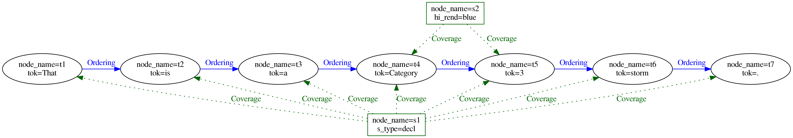

# Representing annotations as graph

## Elements of the graph

The following figure gives an overview of the elements of the graphANNIS model, which is based on a directed graph (see Cormen et al. 2009, p. 1168[^cormen]).

GraphANNIS does not partition the data documents like it was done in relANNIS, graphANNIS partitions the corpora into 

- information about the nodes and node labels, and
- edges and edge label information which are partitioned again into components.

In this model, each node is internally identified by a unique ID.
Node labels consist of a namespace, a name, and a value and are connected to a node by its ID.
No explicit representation of nodes exists: If a node exists there must be at least one label for this node.
There is a special label named "annis::node_name"[^qname] that can be applied to any node to mark its existence.

GraphANNIS has the concept of components for edges.
A component has a type, a name, and a layer. 
It consists of edges and edge labels.
Edges between two nodes are uniquely defined inside a component with the source and target node ID.
There can not be more than one edge between the same two nodes inside the same component.
Each edge can have multiple edge labels.
In addition to the source and target node ID, edge labels also have namespaces, names and values.
For one edge, only one edge label having the same namespace and name can exist.
Graphs are the aggregation of node labels and edge components.

## Corpus structure

GraphANNIS has two kinds of nodes:
- annotation graph nodes and
- corpus graph nodes.

They are both parts of the same graph structure but are distinguished by the special label "annis::node_type".
It can either have the value "node" for nodes belonging to the annotation graph or "corpus" for nodes belonging to the corpus graph.
Nodes that belong to a corpus graph are connected with edges that belong to a component of the type `PartOf`.
The source node is always the node that is part of the (sub-) corpus, and the target node is the node which is higher in the corpus graph hierarchy.

In this example, each annotation graph node belongs to exactly one document and the corpus graph is a tree.
However, the data model allows to add an annotation node to several documents, and a document or sub-corpus can be part of several (sub-) corpora.
In this regard, graphANNIS is more flexible than Salt.
In addition to "corpus" and "node", you can add your own types of node, e.g. "datasource" for nodes that should not be 
treated like a document in meta-data searches, but represent a data source like a text.

## Tokens

Since AQL has no concept of textual data sources, the leafs of the annotation graph in graphANNIS are the tokens.
Tokens have a special label "annis::tok" which has the spanned text as its value.
Additionally, tokens are connected with edges that belong to a component of type `Ordering`.

The ordering edges are very similar to the explicit `SOrderRelation` edges in Salt, except that they are not obligatory but are needed to determine the order of the tokens in the absence of any character index.
They also support multiple tokenizations because there can be more than one component of the type `Ordering`.
When there are multiple components with this type, the name of the component corresponds to the name of the tokenization and is empty for the default tokenization.

## Spans

Spans are nodes that are not a token but cover a set of tokens.
They also implicitly cover the original text that is covered by these tokens.
GraphANNIS expresses these coverage relations by using explicit edges between the spans and each token it covers.
These edges are part of a component of the type `Coverage`.

## Dominance relations

While spans are used to describe non-hierarchical node structures, hierarchical structures like constituent trees are modeled using edges of the type `Dominance`.

These edges can also have additional labels if the annotation scheme requires it.
In contrast to Salt, where nodes have different types, in graphANNIS, only the edges are typed.
Thus, `Dominance` edges can be in theory added to any node.
Since they imply text-coverage, these components should be non-cyclic.

## Pointing relations

For relations that are not implying text-coverage, edges of type `Pointing` can be used.
These have the same semantics as the `SPointingRelation` of Salt and can have additional labels for expressing edge annotations.
The type of a pointing relation in AQLs corresponds to the name of the edge component in graphANNIS.

[^cormen]: T. H. Cormen, C. E. Leiserson, R. L. Rivest, and C. Stein, Introduction to Algorithms, 3rd ed. The MIT Press, 2009.

[^qname]: This is a fully qualified representation of the label name which includes the reserved namespace "annis".